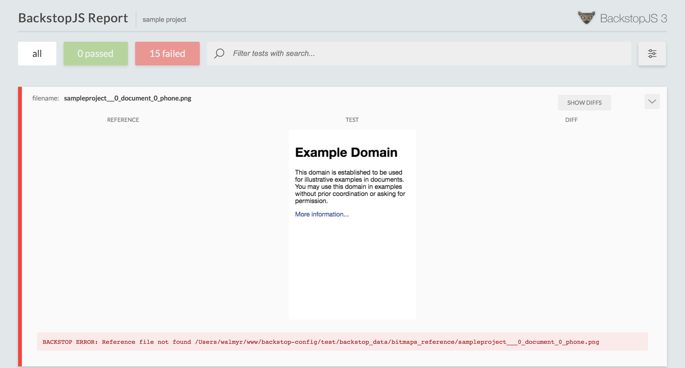

# backstop-config

A sample project with a simple implementation of [BackstopJS](https://github.com/garris/BackstopJS) tests that can be used by anyone who needs to run screenshot comparison tests in static web pages that have different URLs. E.g. http://example.com, http://example.com/page1, http://example.com/page2, etc.

## Pre-requirements

- [git](https://git-scm.com/downloads)
- [Node.js](https://nodejs.org/) (version 8 or greater)
- [Chrome](https://www.google.com/chrome/) browser

> To check the Node.js version installed in your computer, run `node -v`. You should see something like this `v10.13.0`. If you don't have Node.js installed, use the above link to download and install it.

## Installation

[Clone](https://help.github.com/articles/cloning-a-repository/) the project to your computer. Run `git clone https://github.com/wlsf82/backstop-config.git`.

Inside the directory of the cloned project, run `npm i` to install the project dependencies.

## Tests' setup

There is only one file you will have to change to get the project configured to run screenshot comparison tests for your website, which is [`test/basicConfig.js`](./test/basicConfig.js). Update this file by following the instructions in its comments.

> If you use Windows operational system, take a look at the [`NPM_SCRIPT_UPDATE_FOR_WINDOWS.md`](./NPM_SCRIPT_UPDATE_FOR_WINDOWS.md) file.

Done. You are ready to go!

## Running the tests

Run `npm t` to run the Backstop screenshot comparison tests against all the configured URLs of your website.

## Approving bitmaps as references

For the first time running the tests, it is expected that all of them fail and an HTML report should be automatically opened for you to review the taken screenshots. It will look like the one below.

If all the screenshots represent the correct state of the website, you can approve them as bitmaps references so that next time you run the tests, new screenshots will be taken, and compared with the approved ones.

Run `npm run backstop:approve` to approve bitmaps as references to be used during screenshot comparison tests.

## Re-running the tests

Re-run the tests with `npm t`.

After re-running the tests an HTML report like this should be available.

Done! Now every time you make changes that may affect the website visually, you can re-run the tests and get quick feedback to fix visual issues before deploying them to production.

> In case of test failures due to expected visual changes in the website, remember to re-approve the new screenshots as references. Use `npm run backstop:approve` to do so.

## Feedback

Your feedback is very important for this project. If you have any doubts or suggestions, open an issue, and I'll look into it as soon as possible.

## Contribute

This is an open source project. Feel free to [fork](https://help.github.com/articles/fork-a-repo/), improve it and create a [pull request](https://help.github.com/articles/about-pull-requests/). I'll be happy to review and have it merged when it gets in a good state.

___

Made with 💚 by [Walmyr Filho](http://walmyr-filho.com)
